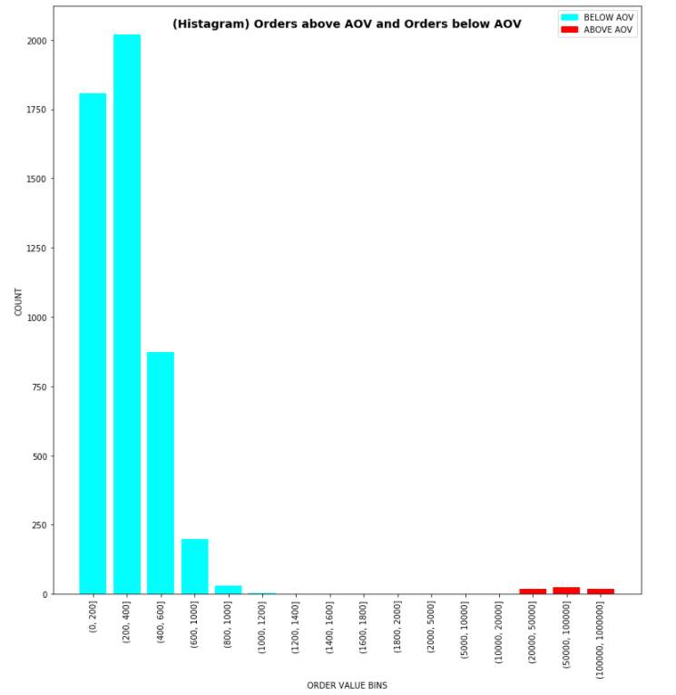

# Shopify-Summer-2022-Data-Science-Intern-Challenge
<h1>
Question 1
</h1> 

_Given some sample data, write a program to answer the following: [click here](https://github.com/samruthv/Shopify-Summer-2022-Data-Science-Intern-Challenge/blob/main/Data_Set.csv) to access the required data set_

On Shopify, we have exactly 100 sneaker shops, and each of these shops sells only one model of shoe. We want to do some analysis of the average order value (AOV). When we look at orders data over a 30 day window, we naively calculate an AOV of $3145.13. Given that we know these shops are selling sneakers, a relatively affordable item, something seems wrong with our analysis

a) __Think about what could be going wrong with our calculation. Think about a better way to evaluate this data.__  
b) __What metric would you report for this dataset?__  
c) __What is its value?__

<h2>
Data Visualization
</h2> 

  

  
 

  

  
 

<h1>
Answers
</h1> 

### a) Think about what could be going wrong with our calculation. Think about a better way to evaluate this data. 

In this case, the fundamental issue of using the average order value (mean) is that the mean is not the best method to evaluate a skewed distribution. The Histogram visualizes this skewness, and the boxplot shows that the AOV is above the max of the boxplot and with the outliers. Distributions that have a skewness value <-1 or >1 are typically classified as "skewed". We get a __skewness of 16.67__ for our order amount data. So, it is clear that the AOV is not the best metric to portray this data.

__What is a better way to evaluate this data?__

We need a metric that is the best measure of central tendency when the data is skewed.

### b) What metric would you report for this dataset?

__The _median_ is generally considered to be the best representative of the central location of the data when you are dealing with skewed data.__ The more skewed the distribution, the greater the difference between the median and mean, and the greater emphasis should be placed on using the median as opposed to the mean.

__Median__ = $284.00  
_The median value is derived from the describe cell above. 50th percentile is the median._

### c) What is its value?

The medium of this data is $284.00. This number makes a lot more sense when you answer the following question.

__How much does the typical customer spend at the sneaker shops?__

__The typical customer spends $284.00 at the Shopify sneaker shops.__

_(The mean of $3,145.13 does not represent the central tendency of purchases by the customers.)_

<h1>
Question 2
</h1>   

For this question you’ll need to use SQL. Follow this link to access the data set required for the challenge. Please use queries to answer the following questions. Paste your queries along with your final numerical answers below.

a) __How many orders were shipped by Speedy Express in total?__  
b) __What is the last name of the employee with the most orders?__  
c) __What product was ordered the most by customers in Germany?__  

<h1>
Answers
</h1> 

### a) How many orders were shipped by Speedy Express in total?

### Query:

    SELECT COUNT(*) FROM [Orders]  
    WHERE [ShipperID] IS 1
    
__Output: 54__

Speedy Express had a total of 54 orders shipped.

### b) What is the last name of the employee with the most orders?

### Query:

    SELECT Orders.EmployeeID, LastName, count(Orders.OrderID) FROM [Employees]  
    INNER JOIN Orders ON Employees.EmployeeID=Orders.EmployeeID  
    GROUP BY Orders.EmployeeID   
    ORDER BY COUNT(Orders.OrderID) DESC LIMIT 1  
    
 __Output: Peacock__

The last name fo the employee with the most orders is Peacock.

### c) What product was ordered the most by customers in Germany?

### Query:
    SELECT Products.ProductID,ProductName,Country,SUM(OrderDetails.Quantity),COUNT(Products.ProductID)  
    FROM (Customers INNER JOIN Orders ON Customers.CustomerID = Orders.CustomerID   
            INNER JOIN OrderDetails ON Orders.OrderID = OrderDetails.OrderID  
            INNER JOIN Products ON OrderDetails.ProductID = Products.ProductID)  
            WHERE Country IN  ("Germany")  
    GROUP BY Products.ProductID   
    ORDER BY COUNT(Products.ProductID) DESC LIMIT 1
    
    or
    
    FROM (Customers INNER JOIN Orders ON Customers.CustomerID = Orders.CustomerID   
        INNER JOIN OrderDetails ON Orders.OrderID = OrderDetails.OrderID  
        INNER JOIN Products ON OrderDetails.ProductID = Products.ProductID)  
        WHERE Country IN  ("Germany")  
    GROUP BY Products.ProductID   
    ORDER BY SUM(OrderDetails.Quantity) DESC LIMIT 1

Most products ordered with regards to number of transactions:

__Output: ProductName = Gorgonzola Telino, ProductID = 31__
    
The product that was ordered the most by customers in Germany was Gorgonzola Telino (ProductID = 31), with a total of 5 orders (number of transactions).

Most products ordered with regards to Quantity of items:

__Output: ProductName = Boston Crab Meat, ProductID = 40__  

The product that was ordered the most by customers in Germany was Boston Crab Meat (ProductID = 40), with a total of 160 orders (quantity of items).

<h1>
Thanks!
</h1>   

__Hello Hiring Manager,__

__Here is the link to my winter 2021-2022 challenge submission if you want to check it out! Lots changed since then :)__

https://github.com/samruthv/Shopify_Challenge/blob/main/Shopify%20Data%20Challenge.ipynb

### Resources:  
    https://jobs.smartrecruiters.com/Shopify/743999796500238-data-science-intern-summer-2022-remote-us-canada-  
    https://matplotlib.org/     
    https://www.ibm.com/docs/en/db2-event-store/2.0.0?topic=notebooks-markdown-jupyter-cheatsheet  

